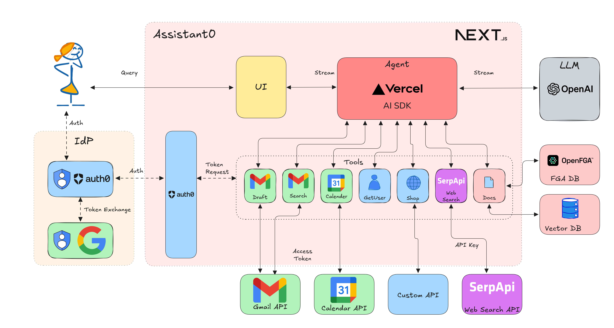

# Assistant0: An AI Personal Assistant Secured with Auth0 - Vercel AI Version

Assistant0 an AI personal assistant that consolidates your digital life by dynamically accessing multiple tools to help you stay organized and efficient.



## About the template

This template scaffolds an Auth0 + Next.js starter app. It mainly uses the following libraries:

- Vercel's [AI SDK](https://github.com/vercel-labs/ai) to handle the AI agent.
- The [Auth0 AI SDK](https://github.com/auth0/auth0-ai-js) and [Auth0 Next.js SDK](https://github.com/auth0/nextjs-auth0) to secure the application and call third-party APIs.
- [Auth0 FGA](https://auth0.com/fine-grained-authorization) to define fine-grained access control policies for your tools and RAG pipelines.
- Postgres with [Drizzle ORM](https://orm.drizzle.team/) and [pgvector](https://github.com/pgvector/pgvector) to store the documents and embeddings.

It's Vercel's free-tier friendly too! Check out the [bundle size stats below](#-bundle-size).

[](https://codespaces.new/auth0-samples/auth0-assistant0)
[](https://vercel.com/new/clone?repository-url=https%3A%2F%2Fgithub.com%2Fauth0-samples%2Fauth0-assistant0)

## 🏗️ High-Level Overview

### Core architecture
- **Next.js 15 App Router** application powered by React 19 with Tailwind CSS and shadcn/ui for the UI layer. The main chat experience lives in `src/app/page.tsx`, while supporting routes (like `/documents`) provide document management workflows.
- **Auth0** secures the app end-to-end. The Next.js SDK and middleware (`src/middleware.ts`) enforce authentication, while helpers in `src/lib/auth0.ts` and `src/lib/auth0-ai.ts` integrate Auth0 AI Token Vault flows.
- **Vercel AI SDK** drives the streaming chat API (`src/app/api/chat/route.ts`), orchestrating GPT-4o-mini responses and coordinating tool calls alongside Auth0 AI interruption handling.

### Tooling & integrations
- Domain-specific tools live in `src/lib/tools` and wrap services such as SerpAPI search, Gmail (search/draft), Google Calendar, a user profile lookup, a shopping workflow guarded by async authorization, and the contextual document retriever (`getContextDocumentsTool`).
- Auth0 AI's interruption utilities pause execution when a tool requires extra consent or delegated credentials, prompting the user to connect Google accounts or approve sensitive actions through the Token Vault UI components in `src/components/auth0-ai`.

### Documents & RAG
- The `/documents` route lets users upload TXT, PDF, or Markdown files, backed by server actions in `src/lib/actions/documents.ts` and UI components like `DocumentUploadForm` and `DocumentItemActions`.
- Uploaded binaries and metadata persist through Drizzle ORM schemas in `src/lib/db/schema`, while embeddings are generated via helpers in `src/lib/rag/embedding.ts` and stored in pgvector indexes for similarity search.
- Auth0 FGA policies defined in `src/lib/fga` register owner/viewer relations so the retriever can safely return only the documents a user is authorized to see during chat sessions.

### Directory highlights
- `src/app`: Next.js routes, API handlers, and global layout/styles.
- `src/components`: Reusable UI building blocks (chat interface, Token Vault dialogs, document cards/forms).
- `src/lib`: Shared server-side code including Auth0 helpers, database access, server actions, tool integrations, RAG logic, and FGA bindings.
- `src/utils`: Lightweight utilities (e.g., class name helpers, nanoid generator).
- `public/`: Static assets consumed by the UI (hero images, icons).

### Data & control flow
1. Requests run through Auth0 middleware; unauthenticated users are redirected to the hosted login page.
2. Authenticated users interact with the chat UI, which streams responses from `/api/chat`.
3. When the agent invokes tools, it can fetch web results, read/write Gmail, check calendars, trigger purchases, or retrieve contextual documents. Sensitive calls may interrupt the flow until the user grants access.
4. Document uploads trigger extraction and embedding pipelines, persist payloads in Postgres, and register FGA relationships so future chats can ground answers in authorized user content.

## 🚀 Getting Started

First, clone this repo and download it locally.

```bash
git clone https://github.com/auth0-samples/auth0-assistant0.git
cd auth0-assistant0/ts-vercel-ai
```

Next, you'll need to set up environment variables in your repo's `.env.local` file. Copy the `.env.example` file to `.env.local`.

- To start with the examples, you'll just need to add your Mistral API key and Auth0 credentials for the Web app and Machine to Machine App.
  - Optionally override the defaults by setting `MISTRAL_CHAT_MODEL` and `MISTRAL_EMBEDDING_MODEL` in your `.env.local` file.
  - You can setup a new Auth0 tenant with an Auth0 Web App and Token Vault following the Prerequisites instructions [here](https://auth0.com/ai/docs/call-others-apis-on-users-behalf).
  - Click on the tenant name on the [Quickstarts](https://auth0.com/ai/docs/call-your-apis-on-users-behalf), Go to the app settings (**Applications** -> **Applications** -> **WebApp Quickstart Client** -> **Settings** -> **Advanced Settings** -> **Grant Types**) and enable the CIBA grant and save.
  - For Async Authorizations, you can setup Guardian Push and Enroll the your user for Guardian following the Prerequisites instructions [here](https://auth0.com/ai/docs/async-authorization).
  - An Auth0 FGA account, you can create one [here](https://dashboard.fga.dev). Add the FGA store ID, client ID, client secret, and API URL to the `.env.local` file.
  - Optionally add a [SerpAPI](https://serpapi.com/) API key for using web search tool.

Next, install the required packages using your preferred package manager and initialize the database.

```bash
npm install # or bun install
# start the postgres database
docker compose up -d
# create the database schema
npm run db:migrate # or bun db:migrate
# initialize FGA store
npm run fga:init # or bun fga:init
```

Now you're ready to run the development server:

```bash
npm run dev  # or bun dev
```

Open [http://localhost:3000](http://localhost:3000) with your browser to see the result! Ask the bot something and you'll see a streamed response:


You can start editing the page by modifying `app/page.tsx`. The page auto-updates as you edit the file.

Backend logic lives in `app/api/chat/route.ts`. From here, you can change the prompt and model, or add other modules and logic.

## 📦 Bundle size

This package has [@next/bundle-analyzer](https://www.npmjs.com/package/@next/bundle-analyzer) set up by default - you can explore the bundle size interactively by running:

```bash
$ ANALYZE=true bun run build
```

## License

This project is open-sourced under the MIT License - see the [LICENSE](LICENSE) file for details.

## Author

This project is built by [Deepu K Sasidharan](https://github.com/deepu105).
